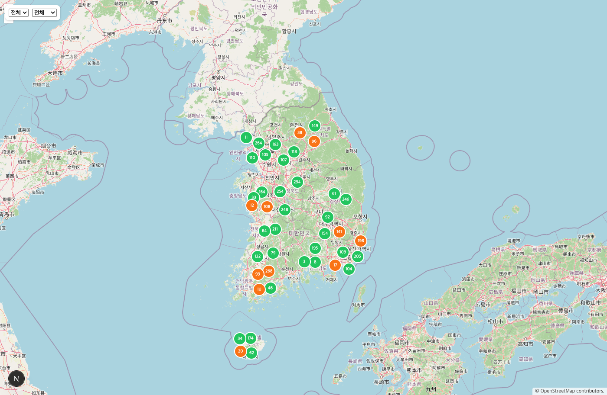

# ⚡ 충전맵 — EV Charger Realtime Map

[](https://github.com/dlehddnjs/binchung/actions/workflows/ci.yml)

환경부 EvCharger API를 5분 델타 폴링으로 수집·적재하고, Next.js + OpenLayers로 전국 충전기 상태를 지도에 보여주는 서비스.



> 스크린샷은 이슈 #11 baseline 성능측정을 위해 생성한 합성 데이터(전국 8,000개 충전소 분포)로 렌더링한 화면입니다.

## 현재 상태

Phase 1 스코프(수집 파이프라인 + 지도 UI, `docs/DESIGN-phase1.md` §9 이슈 #1~#9)는 완료되어 테스트와 함께 커밋되어 있습니다. 아직 실제 배포(이슈 #10)는 진행 전이라 **로컬 실행 전용 데모 단계**입니다 — 아래 "실행 방법"으로 로컬에서 직접 띄워볼 수 있습니다.

- ✅ collector: full sync + 5분 델타 폴링 (`RequestBudget`으로 트래픽 관리)
- ✅ web: OpenLayers 지도, 클러스터링, 필터(급속/완속·상태), 충전소 상세 시트
- ⏳ 배포(Vercel + collector 상시 호스팅 + Supabase) — 미착수
- ⏳ Phase 2: WebSocket 실시간 푸시 / Phase 3: 대규모 렌더링 최적화

## 아키텍처

```
                         ┌──────────────────────────────┐
  환경부 EvCharger API   │  apps/collector (Node worker) │
  ───────────────────▶  │  · 5분 델타 폴링               │
   (5분 delta / 일1회 full)│  · 파싱 → 정규화 → diff 계산   │
                         │  · 일일 요청 예산 관리          │
                         └──────────┬───────────────────┘
                                    │ upsert / append
                                    ▼
                         ┌──────────────────────────────┐
                         │  PostgreSQL (Supabase/Neon)   │
                         │  stations / chargers          │
                         │  charger_status (current)     │
                         │  status_history (append-only) │
                         └──────────┬───────────────────┘
                                    │ read (REST)
                                    ▼
                         ┌──────────────────────────────┐
                         │  apps/web (Next.js App Router)│
                         │  · RSC: 초기 스냅샷 SSR        │
                         │  · Client: OpenLayers 지도    │
                         │  · jotai 상태관리              │
                         └──────────────────────────────┘
```

```
apps/web        Next.js 15 App Router (지도 UI)
apps/collector  Node 워커 (수집 파이프라인)
packages/core   도메인 타입 + 순수 함수 (파서, stat 매핑, diff)
packages/db     DB 마이그레이션(SQL) + 스키마, web/collector가 공유
docs/           설계 문서(DESIGN-phase1.md), 회고(RETRO.md)
fixtures/       환경부 API 응답 원문 (테스트 픽스처)
```

## 기술 결정

| 영역 | 선택 | 비고 |
|---|---|---|
| 상태관리 | jotai | Redux 대신 원자적 상태로 지도/필터/선택 상태 분리 |
| 지도 | OpenLayers (`ol`) | Leaflet/Mapbox 대신 — 벡터 클러스터링을 직접 다뤄보려는 의도적 선택 |
| 데이터 fetching | TanStack Query | Phase 1은 60초 폴링, `StatusFeed` 인터페이스 뒤로 Phase 2에서 WebSocket 교체 예정 |
| DB | PostgreSQL + node-pg-migrate | ORM 스키마 DSL 없이 손으로 쓴 `.sql` 마이그레이션만 사용 |
| 테스트 | Vitest + @testing-library/react + msw | `packages/core`는 test-first 커밋(`test:` → `feat:`) 필수 |

## 실행 방법

```bash
pnpm install
docker compose up -d --wait        # 로컬 Postgres
pnpm --filter @binchung/db migrate:up

pnpm --filter web dev              # http://localhost:3000
pnpm --filter collector dev        # 로컬은 fixtures 모드 기본 (COLLECTOR_MODE=live로 실 API 호출)

pnpm -r test
pnpm -r typecheck
pnpm -r lint
./verify.sh                        # lint + typecheck + test + build + 시크릿 스캔
```

`EVCHARGER_API_KEY`가 필요한 실 API 호출(collector `COLLECTOR_MODE=live`)을 쓰려면 `.env.example`을 `.env`로 복사하고 본인의 키를 채워 넣으세요. `.env`는 gitignore되어 있습니다.

## 성능 baseline (이슈 #11)

Phase 3(WebGL/Web Worker 렌더링 최적화) 착수 전 비교 기준선. 자세한 측정 방법론과 원시 수치는 `docs/RETRO.md` #11 항목 참고. 요약:

- 데이터셋: 합성 전국 충전소 8,000개 / 충전기 11,200개 (`/api/chargers` 서버 안전장치로 지도에는 5,000개까지만 표시 — 기존 설계상 상한)
- Idle 상태(6초 샘플): 평균 프레임 8.3ms, 최대 9.4ms
- 팬(드래그) 인터랙션 중(6초 샘플): 평균 프레임 8.3ms, 최대 9.4ms — 드롭 프레임 없음
- ⚠️ 측정 환경은 헤드리스 Chrome(로컬 샌드박스)이라 절대 FPS 수치(120fps대)는 실제 사용자 디스플레이 주사율과 다를 수 있음 — 이 수치는 "이 환경 기준" 회귀 비교용 baseline

## 문서

- [`docs/DESIGN-phase1.md`](docs/DESIGN-phase1.md) — Phase 1 설계 근거, 데이터 모델, API 계약, 이슈 백로그
- [`docs/RETRO.md`](docs/RETRO.md) — 이슈별 개발 회고
